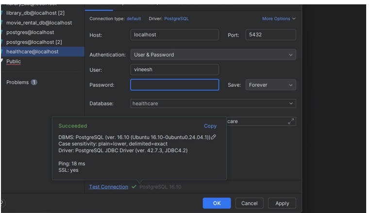
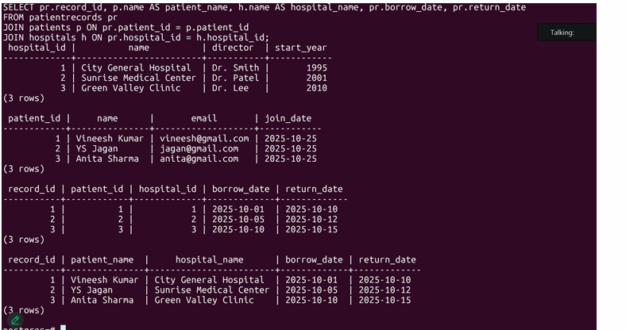

# Database Design Homework 1 - Tippireddy

## Overview

This repository contains the first database design homework assignment, showcasing the design and implementation of a hospital database system using PostgreSQL.

## Project Contents

### 1. Entity-Relationship (ER) Diagram

- Visual representation of the database schema
- Shows all entities and their relationships
- Defines cardinality and primary/foreign keys

### 2. Database Schema

#### Hospital Table

- Primary table structure for hospital data
- Defines columns and data types
- Establishes constraints and relationships

### 3. Table Creation

- SQL `CREATE TABLE` statements
- Column definitions with data types
- Primary keys, foreign keys, and constraints

### 4. Database Implementation

#### PostgreSQL CLI

- Command-line interface interactions with PostgreSQL
- Database connection and query execution
- Shows direct database operations

#### DataGrip IDE

- Visual database management using DataGrip IDE
- GUI-based database exploration and management
- Alternative to CLI for database operations

### 5. SQL Queries

#### Join Queries

- Demonstrates SQL JOIN operations
- Shows data retrieval across multiple related tables
- Examples of INNER JOIN, LEFT JOIN, or similar operations

## Technologies Used

- **Database**: PostgreSQL
- **Tools**:
  - PostgreSQL CLI
  - DataGrip IDE
- **Language**: SQL

## Key Features

- Relational database design following best practices
- Proper normalization of database schema
- Efficient data retrieval using SQL joins
- Multi-table relationships and constraints

## How to Use

1. Review the ER Diagram to understand the database structure
2. Examine the table creation scripts for SQL syntax
3. Reference the query examples for JOIN operations
4. Use PostgreSQL CLI or DataGrip to interact with the database

## Files Included

- `ER Daigram.png` - Entity-Relationship diagram
- `hospital table.png` - Hospital table structure
- `create table screenshot.png` - CREATE TABLE statements
- `CLI Postgresql screenshot.png` - PostgreSQL CLI operations
- `DataGripScreenshot.png` - DataGrip IDE view
- `joinscreenshot.png` - SQL JOIN query examples

## Author

Tippireddy (Vineesh)

## Course

Database Design - Homework 1

---

_Note: This README documents the design and implementation of a hospital database system as part of a database design course._
